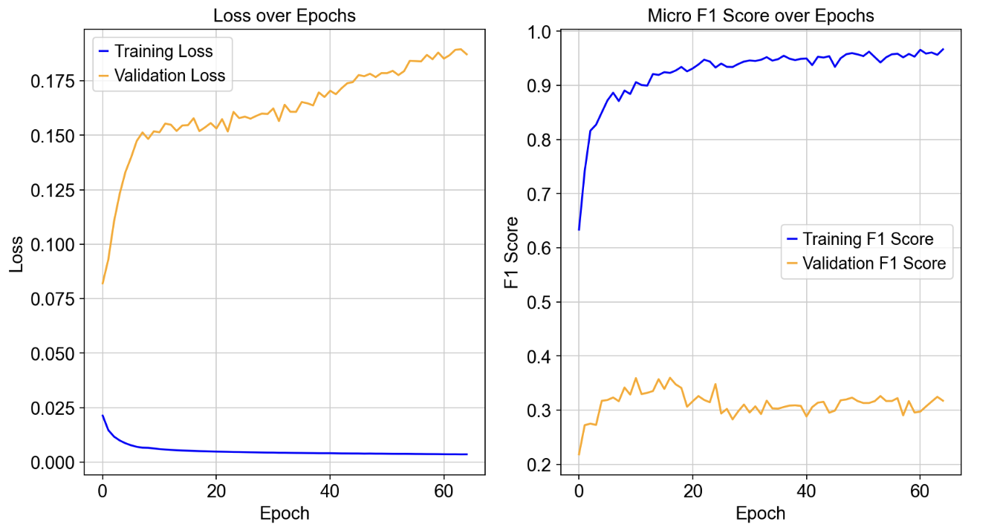

# 🧬 mambaPerturb: A phenotype (transcriptome) to genotype (perturbation) predictor
This project takes a biology-first approach to perturbation prediction of transcriptomic expression from single cell sequencing data (perturbSeq). The goal is to develop a ML model capable of interpreting complex phenotypical data and applying it to disease detection to identify genetic targets for pharmaceutical creation. 

---

## Overview

This project explores the **reverse mapping between transcriptomic phenotypes and their underlying genetic perturbations**.  
Instead of predicting gene-expression changes *after* a known perturbation, the model aims to infer **which gene alteration caused** a given expression profile.

In this project, multiple different interpretting models were created including an MLP model, an attention-based model, an multi-head attention model, a pairwise graph based attention network, and mainly the cross-attention based attnetion network. While these frameworks are not novel, the pipelines that encode and embed the .h5ad data are fully of my own conceptualization and creation. 

#### Positional Encoding of Chromosome Position

The main innovative feature of this model is how it incorporates position-wise chromosome data. Many models do not consider the importance of gene locations in physical space; however, from a biological point of view, the position of a gene has significance as a gene's loci could help determine how it crosses over, which gene sets it belong to, etc. 

In this model however, pyensembl data was used to help assign each measured gene a location. An array of size `(n_gene, 24)` was created as a chromosome embedder, each row corresponding to a one representation 24 chromosmoes a gene could be on (22 autosomal chromosomes, 2 sex-linked chromosomes). Additionally, a loci embedder was also created of size `(n_gene,)` with each entry being the relative loci of a gene on its chromosome (loci position / chromosome length). 

I hypothesize that with these two embeddings, a relative understanding of the significance of gene locations can be developed for prediction. 

#### Cross Attention

Cross-attention was chosen over other models because it delivered superior performance and is the most logical choice for perturbation prediction from phenotype expression, which is fundamentally a sequence-to-sequence task. However, the pairwise graph implementation could also be promising as it is capable of holding more sophisticated gene-to-gene level features—an especially useful feature with the many annotations of a .h5ad file. 

## Folders and Files
- `crossattention.ipynb`: The main jupyter notebook that runs the cross attention-based model 
- `functions.py`: The python file that contains the functions used to preprocess and pipeline the data. 
- `modelCROSSATTN.py`: The python file containing the code for the cross attention backbone. 
- `data`: 
    - `Norman_2019.h5ad`: Dataset utilized to train and benchmark perturbSeq based genetic prediction models 
    - `pbmc3k_raw.h5ad`: Additional perturbSeq data for future training and testing.
    - `graphs`: Folder holding the graphs for ReadMe display
- `additional_models`: Contains the other models developed in the process of working on the project, contains: 
    - `mlp+attn.ipynb`, `optuna.ipynb`,`modelATTN.py`, `modelMLP.py`: files used in creating MLP and attention implementation
    - `pairwise.ipynb`, `modelPairwise.py`: files used in creating the pairwise implementation
-  `arc`: Archive of old and currently unused files made during development

---
## Results:

Utilizing a cross-attention based mechanism inserting phenotype and positional data, a training F1 score of 0.9225 was reached:

However, a new benchmarking paper from Alhmann-Eltz showed a benchmarking method, of which when implemented, showed quite unfavorable validation results (validation sets are made purely from double perturbations):

---

## Current Goals
- Optimize cross-attention module based on new benchmark methods from Alhmann-Eltz et.al's publication in Aug 2025(https://www.nature.com/articles/s41592-025-02772-6#Fig10). 

