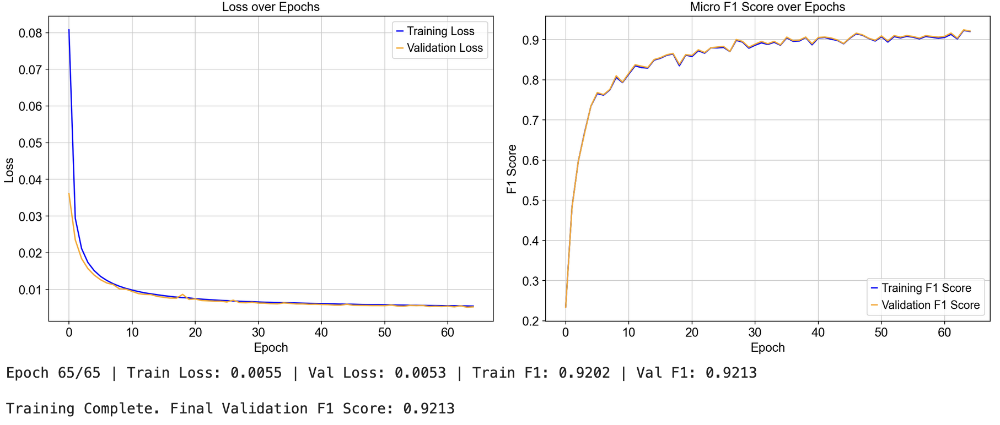

# 🧬 Reverse-Perturbation Inference

### Learning to Identify Genetic Drivers from Transcriptomic Profiles

---

## Overview

This project explores the **reverse mapping between transcriptomic phenotypes and their underlying genetic perturbations**.  
Instead of predicting gene-expression changes *after* a known perturbation, the model aims to infer **which gene alteration caused** a given expression profile.

Using **Perturb-seq** data as supervised training (where each cell’s perturbation is known),  
the goal is to build models capable of identifying hidden gene drivers in complex biological systems —  
for example, in cancer transcriptomes where multiple mutations may underlie observed states.

---
## Results:
Utilizing a corss-attention based mechanism inserting phenotype and positional data, an F1 score of 0.9225 was reached:

---

## Current Goals

- Train deep models (MLP, Transformer, and Mamba) to classify perturbations from post-perturbation expression data.  
- Evaluate model accuracy, generalization, and interpretability.  
- Test whether learned representations can transfer to datasets such as **CCLE** or **TCGA** to infer likely cancer driver genes.  

